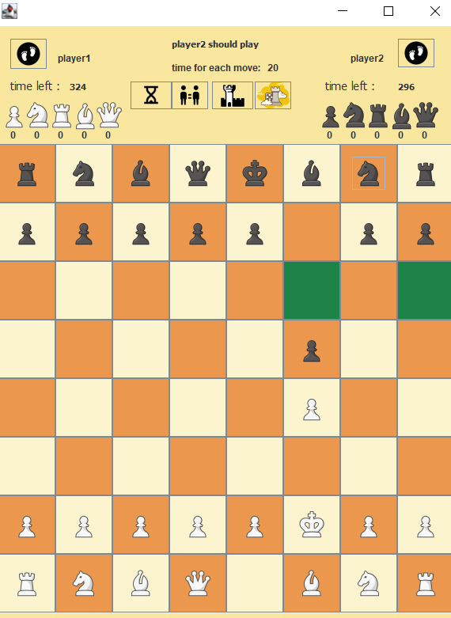

# ChessGame

<!-- ABOUT THE PROJECT -->
## About The Project
this project is my final project for advanced programing in java 
To start the game, you can run the project in your favorite project ide by running the server.java located in src/server.
when you start the sever , following frame will come up. you can decide if you want to play online or offline
then you will enter your name and enjoy the game :)

